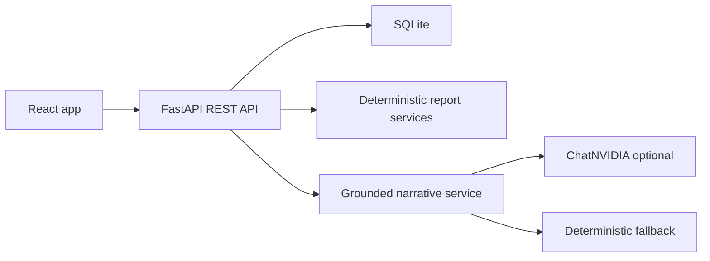

# SwasthiQ EOD Billing & Analytics Agent

A full-stack clinic-day billing workflow for importing a raw JSON billing log and producing deterministic reconciliation, deterministic analytics, and a grounded owner-facing narrative with traced figures.

## Product Overview

SwasthiQ EOD helps a clinic owner answer the end-of-day questions quickly:

- how much was billed, collected, outstanding, and refunded;
- which hour produced the most billed sales;
- which medicines ranked highest by quantity and revenue;
- what plain-language summary can be shared with an owner.

The deterministic backend owns every number. The LLM layer may only explain approved report facts and every narrative figure is returned with a backend trace.

## Key Features

- Billing JSON import with safe frontend file checks and backend row validation.
- Atomic clinic-day create/replace with SQLite persistence and Alembic migrations.
- Reconciliation dashboard with payment-mode splits.
- Analytics dashboard with hourly revenue chart, backend peak hour, and separate medicine rankings.
- AI Narrative Summary page with explicit generate/regenerate actions.
- Traced Figures panel mapping summary values back to deterministic report paths.
- Deterministic fallback when NVIDIA is disabled, unavailable, or unsafe.
- Empty-day, refund-only, and partial-import handling.
- Production-safe request logging, security headers, CORS, and local rate limiting for narrative generation.
- Railway backend and Vercel frontend deployment configuration.

## Screens

- `/reports` - import billing logs and open recent reports.
- `/reports/:clinicId/:businessDate/reconciliation` - deterministic EOD reconciliation.
- `/reports/:clinicId/:businessDate/analytics` - deterministic analytics.
- `/reports/:clinicId/:businessDate/narrative` - grounded AI/fallback owner summary and traces.

## Architecture



More detail: `docs/architecture/FINAL_ARCHITECTURE.md`.

## Tech Stack

- Backend: Python, FastAPI, Pydantic v2, SQLAlchemy 2, Alembic, SQLite.
- Agentic layer: LangChain, `langchain-nvidia-ai-endpoints`, `ChatNVIDIA`.
- Frontend: React, Vite, TypeScript, React Router, Recharts, CSS modules.
- Deployment: Railway backend, Vercel frontend.

## Repository Structure

```text
backend/       Python REST API, migrations, Dockerfile, startup script
frontend/      React application
docs/          architecture, API, operations and submission docs
demo-data/     independent synthetic demo fixtures
```

## Data Model

SQLite stores:

- `clinic_days`
- `visits`
- `line_items`
- `ingestion_errors`
- `narratives`

Replacing a clinic-day is transactional. Valid replacements swap report children and invalidate stale narratives only when the deterministic report hash changes.

## API Overview

Base path: `/api/v1`.

- `GET /health`
- `GET /clinic-days`
- `PUT /clinic-days/{clinic_id}/{business_date}`
- `GET /clinic-days/{clinic_id}/{business_date}`
- `GET /clinic-days/{clinic_id}/{business_date}/errors`
- `GET /clinic-days/{clinic_id}/{business_date}/narrative`
- `POST /clinic-days/{clinic_id}/{business_date}/narrative`

Generated OpenAPI: `docs/contracts/openapi.json`. Guide: `docs/api/API_GUIDE.md`.

## Financial Definitions

All money is integer paise in the backend.

- Gross line total: `sum(qty * unit_price_paise)`.
- Billed: gross total minus discount for non-refund rows.
- Collected: `amount_paid_paise` for non-refund rows.
- Outstanding: billed minus collected.
- Refunds: absolute value of negative refund payments.
- Payment-mode splits are computed by the backend.

The deterministic layer never calls an LLM.

## Analytics Definitions

- Revenue by hour uses accepted non-refund sales and UTC timestamps.
- Peak hour is selected by the backend.
- Top medicines by quantity and by revenue are separate rankings.
- Refund rows do not create sales analytics.

## Grounded Narrative Design

The narrative service builds an approved fact catalogue from the deterministic report. The model receives only safe context and approved placeholders. The backend validates:

- structured output shape;
- allowed fact usage by intent;
- required facts by day type;
- no invented literal numbers;
- unsupported claims such as profit or trends;
- trace coverage.

If NVIDIA is unavailable or a response cannot be safely validated, deterministic fallback is returned.

## Traced Figures

The frontend displays backend trace entries only. It does not parse numbers from narrative text or construct report paths. Every displayed trace includes the backend display value and deterministic report path.

## Local Setup

Backend:

```bash
cd backend
python3 -m pip install -r requirements.txt
DATABASE_URL=sqlite:///./swasthiq_eod.db python3 -m alembic upgrade head
DATABASE_URL=sqlite:///./swasthiq_eod.db python3 -m uvicorn app.main:create_app --factory --host 127.0.0.1 --port 8000
```

Frontend:

```bash
cd frontend
npm install
npm run generate:api
npm run dev -- --host 127.0.0.1 --port 5173
```

Open `http://127.0.0.1:5173/reports`.

## Configuration

Backend `.env` values:

- `APP_ENV`
- `APP_VERSION`
- `DATABASE_URL`
- `CORS_ALLOWED_ORIGINS`
- `CORS_ALLOW_CREDENTIALS=false`
- `LOG_LEVEL=INFO`
- `LOG_FORMAT=json` for production
- `MAX_RECORDS_PER_REQUEST`
- `MAX_REQUEST_BODY_BYTES`
- `STORE_REJECTED_RAW_ROWS=false`
- `NARRATIVE_RATE_LIMIT_PER_MINUTE`
- `LLM_ENABLED`
- `LLM_PROVIDER=nvidia`
- `NVIDIA_API_KEY`
- `NVIDIA_MODEL`
- `NVIDIA_BASE_URL`
- `LLM_TIMEOUT_SECONDS`
- `LLM_MAX_TOKENS`
- `LLM_TEMPERATURE`
- `LLM_TRANSPORT_RETRIES`

Frontend `.env` values:

- `VITE_API_BASE_URL`
- `VITE_DEV_PROXY_TARGET`
- `VITE_APP_VERSION`

Never put `NVIDIA_API_KEY` or `DATABASE_URL` in frontend configuration.

## NVIDIA Configuration

`NVIDIA_API_KEY` is optional for local/demo operation. If it is missing, the API returns a grounded deterministic fallback summary. To use live model generation, configure the backend only:

```env
LLM_ENABLED=true
LLM_PROVIDER=nvidia
NVIDIA_API_KEY=<your-nvidia-api-key>
NVIDIA_MODEL=nvidia/nemotron-3-nano-30b-a3b
```

## Demo Data

Use synthetic files in `demo-data/`:

- `normal-day.json`
- `partial-import-day.json`
- `refund-only-day.json`
- `empty-day.json`

These are independent demo fixtures and not the original evaluation data.

## Deployment

Backend on Railway:

1. Create Railway service from this repo.
2. Use `railway.toml` and `backend/Dockerfile`.
3. Add a persistent volume for SQLite.
4. Set `DATABASE_URL=sqlite:////path/on/volume/swasthiq_eod.db`.
5. Set `APP_ENV=production`, `LOG_FORMAT=json`, `CORS_ALLOWED_ORIGINS=<vercel-url>`.
6. Optionally set `NVIDIA_API_KEY`.

Frontend on Vercel:

1. Use `vercel.json`.
2. Set `VITE_API_BASE_URL=<railway-backend-origin>`.
3. Build command and output directory are already configured.
4. SPA rewrites support deep links.

Live deployment was not executed from this workspace.

## Logging, Privacy, And Security

- Request IDs are returned through `X-Request-ID`.
- Production logs can be JSON.
- Billing rows, request bodies, narrative text, prompts, raw model output, and secrets must never be logged.
- CORS is explicit and credentials are disabled.
- Security headers are applied by backend and Vercel config.
- Narrative generation has a process-local rate limit.

Guide: `docs/operations/LOGGING_AND_OBSERVABILITY.md`.

## Quality Commands

Backend:

```bash
cd backend
python3 -m pytest -m "not live_nvidia" -q
python3 -c "from app.main import create_app; create_app()"
DATABASE_URL=sqlite:////tmp/swasthiq_migration_check.db python3 -m alembic upgrade head
```

Frontend:

```bash
cd frontend
npm run generate:api
npm run typecheck
npm run lint
npm run build
```

## Known Limitations

- No authentication or real clinic multi-user controls.
- SQLite persistence on Railway requires a persistent volume.
- Narrative rate limiting is process-local.
- Live NVIDIA generation depends on a valid backend-only key.
- No profit or margin is computed because cost price is not part of the input schema.

## Submission Links

- Public repository: `TODO`
- Frontend live URL: `TODO`
- Backend health URL: `TODO`
- Demo video: `TODO`

## Demo Video Guide

Use `docs/submission/DEMO_VIDEO_SCRIPT.md`.
