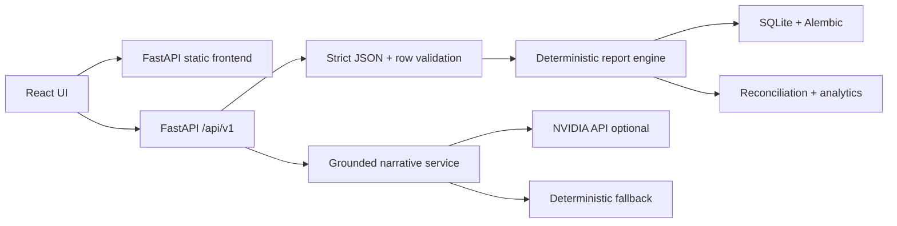

# SwasthiQ EOD Agent

<div align="center">

<h3>Clinic-day billing reconciliation, analytics, and grounded AI summaries in one production-ready workflow.</h3>

<p>
  <a href="https://github.com/satvikkesarwani/swasthiq-eod-agent">
    
  </a>
  
  
  
  
</p>

<p>
  <b>Import JSON billing logs</b> -
  <b>validate every row</b> -
  <b>generate deterministic reports</b> -
  <b>explain only backend-approved facts</b>
</p>

</div>

---

## Overview

SwasthiQ EOD is a full-stack command centre for a clinic owner or operator closing a business day. It imports a raw billing log, validates every row, stores a canonical clinic-day report, and exposes three operational views:

- **Reports**: upload a clinic-day JSON file, detect mismatched clinic/date metadata, review partial imports, and open stored reports.
- **Reconciliation**: see billed, collected, outstanding, refunds, discounts, and payment-mode splits from backend-owned calculations.
- **Analytics**: inspect hourly revenue, peak billing hour, medicine quantity rankings, and medicine revenue rankings.
- **Narrative**: generate an owner-facing AI or deterministic fallback summary with traceable report facts.

The important rule: **the deterministic backend owns every number**. The LLM layer can only explain approved facts and every narrative figure maps back to a backend trace.

---

## Live Routes

| Surface | Route |
| --- | --- |
| App home | `/` |
| Reports workspace | `/reports` |
| Reconciliation | `/reports/:clinicId/:businessDate/reconciliation` |
| Analytics | `/reports/:clinicId/:businessDate/analytics` |
| Narrative summary | `/reports/:clinicId/:businessDate/narrative` |
| Backend health | `/api/v1/health` |
| OpenAPI | `/openapi.json` |

The current Railway setup serves the React frontend and FastAPI backend from the same service. Frontend API calls use same-origin `/api/v1` by default.

---

## Feature Matrix

| Area | What is implemented |
| --- | --- |
| Import safety | UTF-8 decoding, strict JSON parsing, duplicate-key rejection, file-size checks, clinic/date inference, mismatch blocking |
| Backend validation | Strict Pydantic models, exact integer money fields, enum validation, row issue caps, raw-row privacy controls |
| Reconciliation | Integer paise arithmetic, payment-mode buckets, collection-rate basis points, refund and outstanding handling |
| Analytics | UTC hourly revenue, backend-selected peak hour, separate medicine rankings by quantity and revenue |
| Persistence | SQLite, Alembic migrations, atomic create/replace, report hashes, stale narrative invalidation |
| AI narrative | LangChain NVIDIA provider, cyclic API-key rotation, deterministic fallback, trace validation |
| Observability | Request IDs, structured logs, safe error envelopes, privacy-safe diagnostics |
| Deployment | Single Railway Docker image that builds React and serves it through FastAPI |

---

## Architecture



More detail: `docs/architecture/FINAL_ARCHITECTURE.md`.

---

## Data Contract

Input is a JSON array of visit rows:

```json
[
  {
    "clinic_id": "CLN-KNP-014",
    "visit_id": "V-20260727-001",
    "timestamp": "2026-07-27T09:10:00Z",
    "doctor_id": "DOC-014-01",
    "line_items": [
      { "drug_name": "PARACETAMOL", "qty": 3, "unit_price_paise": 2000 }
    ],
    "payment_mode": "cash",
    "amount_paid_paise": 6000,
    "discount_paise": 0,
    "is_refund": false
  }
]
```

The backend rejects rows that do not match the route clinic ID and business date. Partial imports are allowed when at least one row is valid; all-invalid imports do not replace stored reports.

---

## API

Base path: `/api/v1`

| Method | Endpoint | Purpose |
| --- | --- | --- |
| `GET` | `/health` | Service and database health |
| `GET` | `/clinic-days` | List stored reports with filters |
| `PUT` | `/clinic-days/{clinic_id}/{business_date}` | Validate and create/replace a clinic-day report |
| `GET` | `/clinic-days/{clinic_id}/{business_date}` | Read canonical report |
| `GET` | `/clinic-days/{clinic_id}/{business_date}/errors` | Read stored validation issues |
| `GET` | `/clinic-days/{clinic_id}/{business_date}/narrative` | Read current narrative |
| `POST` | `/clinic-days/{clinic_id}/{business_date}/narrative` | Generate or regenerate narrative |

Generated contract: `docs/contracts/openapi.json`

API guide: `docs/api/API_GUIDE.md`

---

## Tech Stack

| Layer | Stack |
| --- | --- |
| Frontend | React 19, Vite, TypeScript, React Router, Recharts, CSS modules |
| Backend | FastAPI, Pydantic v2, SQLAlchemy 2, Alembic |
| Agentic layer | LangChain, `langchain-nvidia-ai-endpoints`, ChatNVIDIA |
| Database | SQLite locally; Railway volume or Postgres-compatible `DATABASE_URL` for production |
| Deployment | Docker multi-stage build on Railway |

---

## Repository Map

```text
backend/       FastAPI app, deterministic services, migrations, API schemas
frontend/      React dashboard, import workflow, report views
docs/          architecture, API, operations, implementation notes
demo-data/     synthetic demo billing logs
Dockerfile     single-service Railway build: React dist + FastAPI
railway.toml   Railway Docker deployment config
start.sh       production startup: migrations + uvicorn
```

---

## Local Setup

Backend:

```bash
cd backend
python3 -m pip install -r requirements.txt
DATABASE_URL=sqlite:///./swasthiq_eod.db python3 -m alembic upgrade head
DATABASE_URL=sqlite:///./swasthiq_eod.db python3 -m uvicorn app.main:create_app --factory --host 127.0.0.1 --port 8000
```

Frontend:

```bash
cd frontend
npm install
npm run generate:api
npm run dev -- --host 127.0.0.1 --port 5173
```

Open `http://127.0.0.1:5173/reports`.

---

## Railway Deployment

This repo is configured for one Railway service:

1. Railway reads the root `Dockerfile`.
2. The Docker build installs frontend dependencies and runs `npm run build`.
3. The built React app is copied into the backend image.
4. FastAPI serves `/`, `/reports`, and `/reports/*` as the frontend.
5. API routes remain under `/api/v1`.

Required Railway settings:

```env
APP_ENV=production
LOG_FORMAT=json
CORS_ALLOWED_ORIGINS=https://swasthiq-eod-agent-production.up.railway.app
```

Recommended for real persistence:

```env
DATABASE_URL=<persistent-database-url>
```

Optional for live AI summaries:

```env
LLM_ENABLED=true
LLM_PROVIDER=nvidia
NVIDIA_API_KEYS=<comma-separated-backend-only-keys>
NVIDIA_MODEL=nvidia/nemotron-3-nano-30b-a3b
```

Keep Railway public networking on port `8080`.

---

## Demo Data

Use the synthetic fixtures in `demo-data/`:

| File | Scenario |
| --- | --- |
| `normal-day.json` | Clean business day |
| `partial-import-day.json` | Valid report with rejected rows |
| `refund-only-day.json` | Refund-only clinic day |
| `empty-day.json` | No-activity day |

---

## Quality Checks

Backend:

```bash
cd backend
python3 -m pytest -m "not live_nvidia" -q
python3 -c "from app.main import create_app; create_app()"
DATABASE_URL=sqlite:////tmp/swasthiq_migration_check.db python3 -m alembic upgrade head
```

Frontend:

```bash
cd frontend
npm run generate:api
npm run typecheck
npm run lint
npm run build
```

---

## Security And Privacy

- API keys stay backend-only.
- Billing rows, request bodies, prompts, model output, and secrets are not logged.
- Request IDs are returned through `X-Request-ID`.
- Production logs support JSON format.
- CORS is explicit; credentials are disabled by default.
- Security headers are applied by the backend.
- Narrative generation has a process-local rate limit.

Operations guide: `docs/operations/LOGGING_AND_OBSERVABILITY.md`.

---

## Known Limits

- No authentication or real clinic multi-user authorization.
- SQLite on Railway needs a persistent volume; otherwise data can reset across deploys.
- Narrative rate limiting is process-local.
- Live NVIDIA generation depends on valid backend-only NVIDIA credentials.
- Profit and margin are not computed because cost price is not part of the input schema.

---

## Project Links

| Item | Link |
| --- | --- |
| Repository | `https://github.com/satvikkesarwani/swasthiq-eod-agent` |
| Railway app | `https://swasthiq-eod-agent-production.up.railway.app` |
| Health | `https://swasthiq-eod-agent-production.up.railway.app/api/v1/health` |
| Demo script | `docs/submission/DEMO_VIDEO_SCRIPT.md` |
