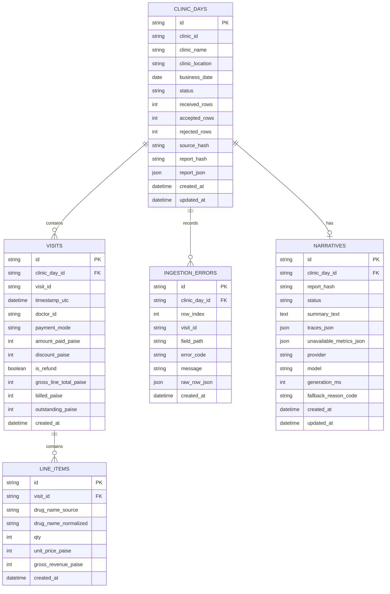

# Step 2 — User Flow, Architecture, API Contract, and Repository Design

## 1. Design goals

1. Make deterministic calculation code independently testable.
2. Ensure the AI layer cannot modify or replace report values.
3. Make clinic-day replacement atomic and idempotent.
4. Keep the API compact enough for a three-day assignment.
5. Match the three requested screens while adding only low-risk business polish.
6. Make the code easy to extend during a live follow-up interview.

## 2. End-to-end user flow

### 2.1 First use / import

1. User opens the application.
2. User selects clinic and business date.
3. User chooses a JSON billing log.
4. Frontend performs only JSON syntax/file-size checks.
5. Frontend submits explicit clinic/date plus records to the API.
6. API validates request context and each row.
7. API computes one deterministic report from accepted rows.
8. API atomically stores accepted rows, errors, report, and report hash.
9. Reconciliation screen opens.
10. User can navigate to Analytics and AI Summary through the shared sidebar.

### 2.2 Partial ingestion

1. API receives a mixture of valid and invalid rows.
2. Valid rows are accepted; invalid rows are excluded everywhere.
3. Report is produced with status `completed_with_errors`.
4. UI shows an import summary and an issue drawer.
5. The owner can still use all three screens.

### 2.3 Empty day

1. User submits clinic/date with `records: []`.
2. API creates a valid zero-activity report.
3. Reconciliation shows zero values.
4. Analytics shows empty states and no peak hour.
5. Narrative says no billable activity was recorded.

### 2.4 Refund-only day

1. Valid refund records pass validation.
2. Reconciliation reports refund totals by payment mode.
3. Sales revenue and medicine rankings remain empty.
4. Narrative explains refund activity without calling it sales.

### 2.5 Update/re-import

1. User imports another file for the same clinic/date.
2. API validates and computes the replacement in memory first.
3. Database transaction replaces stored records/report/errors.
4. New report hash is generated.
5. Old narrative is deleted or marked stale.
6. Transaction commits only when all deterministic writes succeed.
7. UI refreshes all three screens from the new report.

## 3. High-level architecture

```text
React frontend
    |
    | HTTPS / JSON
    v
Python REST API
    |
    +-- Request/schema validation
    +-- Ingestion orchestration
    +-- Deterministic reconciliation engine
    +-- Deterministic analytics engine
    +-- Report hashing and trace catalogue
    +-- Narrative orchestration
    |       +-- LLM provider adapter
    |       +-- Structured-output validator
    |       +-- Figure-trace validator
    |       +-- Deterministic fallback renderer
    |
    +-- SQLite repository layer
```

### Hard boundary

```text
Deterministic domain/services  -- MUST NOT IMPORT -->  LLM SDK/provider
```

The narrative service receives an immutable report DTO. It never receives database models or raw visits.

## 4. Backend module boundaries

```text
backend/app/
├── api/
│   ├── routes_clinic_days.py
│   ├── routes_narratives.py
│   └── routes_health.py
├── core/
│   ├── config.py
│   ├── errors.py
│   ├── logging.py
│   └── money.py
├── db/
│   ├── session.py
│   └── migrations/
├── models/
│   ├── clinic_day.py
│   ├── visit.py
│   ├── line_item.py
│   ├── ingestion_error.py
│   └── narrative.py
├── schemas/
│   ├── ingestion.py
│   ├── report.py
│   ├── analytics.py
│   ├── narrative.py
│   └── errors.py
├── services/
│   ├── ingestion_service.py
│   ├── row_validator.py
│   ├── reconciliation_service.py
│   ├── analytics_service.py
│   ├── report_service.py
│   ├── trace_service.py
│   └── narrative_service.py
├── repositories/
│   ├── clinic_day_repository.py
│   └── narrative_repository.py
├── integrations/
│   └── llm_provider.py
└── main.py
```

## 5. Data model

### 5.1 `clinic_days`

- `id`: UUID/string primary key.
- `clinic_id`: string.
- `clinic_name`: nullable string.
- `clinic_location`: nullable string.
- `business_date`: date.
- `status`: `completed`, `completed_with_errors`.
- `received_rows`: integer.
- `accepted_rows`: integer.
- `rejected_rows`: integer.
- `source_hash`: SHA-256 of canonical request records.
- `report_hash`: SHA-256 of canonical deterministic report.
- `report_json`: deterministic report snapshot.
- `created_at`, `updated_at`: UTC timestamps.
- Unique constraint: `(clinic_id, business_date)`.
- Indexes: `clinic_id`, `business_date`, and composite `(clinic_id, business_date)`.

### 5.2 `visits`

- `id`.
- `clinic_day_id` foreign key.
- `visit_id`.
- `timestamp_utc`.
- `doctor_id`.
- `payment_mode`.
- `amount_paid_paise`.
- `discount_paise`.
- `is_refund`.
- `gross_line_total_paise`.
- `billed_paise`.
- `outstanding_paise`.
- `created_at`.
- Unique constraint: `(clinic_day_id, visit_id)`.
- Indexes: `clinic_day_id`, `timestamp_utc`, and `payment_mode`.

### 5.3 `line_items`

- `id`.
- `visit_id` foreign key.
- `drug_name_source`.
- `drug_name_normalized`.
- `qty`.
- `unit_price_paise`.
- `gross_revenue_paise`.
- `created_at`.

### 5.4 `ingestion_errors`

- `id`.
- `clinic_day_id` foreign key.
- `row_index`.
- `visit_id` nullable.
- `field_path` nullable.
- `error_code`.
- `message`.
- `raw_row_json` optional; omit in logs.
- `created_at`.

### 5.5 `narratives`

- `id`.
- `clinic_day_id` unique foreign key.
- `report_hash`.
- `status`: `generated`, `fallback`, `failed`, `stale`.
- `summary_text`.
- `traces_json`.
- `unavailable_metrics_json`.
- `provider` nullable.
- `model` nullable.
- `generation_ms` nullable.
- `fallback_reason_code` nullable.
- `created_at`, `updated_at`.

A narrative is valid only when `narrative.report_hash == clinic_day.report_hash`.

## 6. Atomic update strategy

For `PUT /api/v1/clinic-days/{clinic_id}/{business_date}`:

1. Validate route/body context.
2. Validate all rows and partition accepted/rejected in memory.
3. Compute full deterministic report in memory.
4. Canonicalize and hash source/report.
5. Open SQLite transaction.
6. Upsert clinic-day row.
7. Delete existing child visits, line items, and errors for that clinic-day.
8. Insert replacement accepted rows and errors.
9. Store report snapshot/hash.
10. Delete or mark old narrative stale if report hash changed.
11. Commit.
12. Roll back on any write failure.

This guarantees that readers never see a partially updated clinic-day.

## 7. REST API contract

Base path: `/api/v1`

### 7.1 Health

```http
GET /api/v1/health
```

Response:

```json
{
  "status": "healthy",
  "database": "connected",
  "version": "1.0.0"
}
```

### 7.2 List available clinic-days

```http
GET /api/v1/clinic-days?clinic_id=CLN-KNP-014
```

Response:

```json
{
  "items": [
    {
      "clinic_id": "CLN-KNP-014",
      "business_date": "2026-07-27",
      "status": "completed_with_errors",
      "accepted_rows": 18,
      "rejected_rows": 1,
      "updated_at": "2026-07-31T10:00:00Z"
    }
  ]
}
```

### 7.3 Create or replace a clinic-day

```http
PUT /api/v1/clinic-days/{clinic_id}/{business_date}
Content-Type: application/json
```

Request:

```json
{
  "records": []
}
```

Success response: `200` for first creation, replacement, and unchanged idempotent uploads.

```json
{
  "operation": "created",
  "clinic_id": "CLN-KNP-014",
  "business_date": "2026-07-27",
  "status": "completed_with_errors",
  "ingestion": {
    "received_rows": 19,
    "accepted_rows": 18,
    "rejected_rows": 1,
    "errors": []
  },
  "report": {
    "reconciliation": {},
    "analytics": {},
    "data_quality_warnings": []
  },
  "report_hash": "sha256:...",
  "narrative_status": "not_generated"
}
```

### 7.4 Read full clinic-day report

```http
GET /api/v1/clinic-days/{clinic_id}/{business_date}
```

Returns clinic metadata, ingestion summary, reconciliation, analytics, warnings, report hash, and current narrative status.

### 7.5 Read ingestion errors

```http
GET /api/v1/clinic-days/{clinic_id}/{business_date}/errors
```

Returns paginated row-level actionable errors with `row_index`, `visit_id`, `field_path`, `error_code`, and safe `message`. Raw rejected rows are never serialized.

### 7.6 Generate or regenerate narrative

```http
POST /api/v1/clinic-days/{clinic_id}/{business_date}/narrative
```

Request:

```json
{
  "force_regenerate": false
}
```

Behavior:

- Reuse existing narrative when report hash matches and `force_regenerate` is false.
- Otherwise call provider, validate schema/traces, and save.
- Fall back to deterministic template after provider/schema failure.

Response:

```json
{
  "status": "generated",
  "summary": "...",
  "traces": [
    {
      "display_value": "₹3,190",
      "report_path": "reconciliation.total_billed_paise",
      "raw_value": 319000
    }
  ],
  "unavailable_metrics": [
    {
      "metric": "profit",
      "reason": "Cost-price data was not provided."
    }
  ],
  "report_hash": "sha256:..."
}
```

### 7.7 Read narrative

```http
GET /api/v1/clinic-days/{clinic_id}/{business_date}/narrative
```

- `200` when current.
- `404` when not generated.
- `409` if a stored narrative is stale relative to the report hash.

## 8. Error response standard

```json
{
  "error": {
    "code": "VALIDATION_FAILED",
    "message": "The billing log contains invalid records.",
    "details": [
      {
        "row_index": 18,
        "field_path": "payment_mode",
        "error_code": "FIELD_REQUIRED",
        "message": "payment_mode is required"
      }
    ],
    "request_id": "req_..."
  }
}
```

Expected statuses:

- `400`: invalid JSON/request structure.
- `404`: clinic-day not found.
- `409`: context conflict/stale narrative.
- `413`: file/request too large.
- `422`: schema or domain validation failure, including `NO_VALID_RECORDS` for all-invalid non-empty uploads.
- `500`: unexpected failure only.
- `503`: dependency unavailable when no fallback can be produced.

## 8.1 Current ER Summary



## 9. Report response shape

```json
{
  "reconciliation": {
    "total_billed_paise": 319000,
    "total_collected_paise": 317200,
    "total_outstanding_paise": 1800,
    "total_refunds_paise": 0,
    "total_discount_paise": 7000,
    "collection_rate": 0.994357,
    "pending_visit_count": 3,
    "refund_visit_count": 0,
    "by_payment_mode": {
      "cash": {},
      "card": {},
      "upi": {}
    }
  },
  "analytics": {
    "revenue_by_hour": [
      {"hour_utc": 9, "revenue_paise": 9000}
    ],
    "peak_hour": {
      "start_hour_utc": 13,
      "end_hour_utc": 14,
      "revenue_paise": 76000
    },
    "top_medicines_by_quantity": [],
    "top_medicines_by_revenue": []
  },
  "data_quality_warnings": []
}
```

All 24 hours may be returned to simplify chart rendering and zero-state consistency.

## 10. Narrative grounding design

### 10.1 Trace catalogue

Before the LLM call, generate an allow-list such as:

```json
{
  "reconciliation.total_billed_paise": {
    "raw_value": 319000,
    "display_value": "₹3,190"
  },
  "analytics.peak_hour.revenue_paise": {
    "raw_value": 76000,
    "display_value": "₹760"
  }
}
```

### 10.2 Model output schema

The model returns semantic statements with trace keys, not arbitrary raw numbers.

```json
{
  "sections": [
    {
      "text": "₹3,190 was billed and ₹3,172 was collected.",
      "trace_keys": [
        "reconciliation.total_billed_paise",
        "reconciliation.total_collected_paise"
      ]
    }
  ],
  "unavailable_metrics": []
}
```

### 10.3 Post-validation

- Schema-validate output.
- Ensure every trace key exists.
- Extract numeric tokens from text.
- Compare each token against allowed display variants from referenced trace keys.
- Reject extra numeric tokens.
- Compose final trace panel from backend catalogue, not model-provided raw values.

### 10.4 Fallback

A deterministic template uses the same trace catalogue and report fields. This means the endpoint remains useful when the LLM is unavailable.

## 11. Frontend information architecture

Routes:

```text
/                         -> redirect to latest report or import state
/reports/:clinic/:date/reconciliation
/reports/:clinic/:date/analytics
/reports/:clinic/:date/narrative
```

Shared app shell:

- Persistent icon sidebar.
- Clinic title/subtitle.
- Date selector.
- Compact Import Log action.
- Import result/status banner.

### Reconciliation page components

- `MetricCard` x4.
- `PaymentModeTable`.
- `ImportStatusBanner`.
- `ValidationIssuesDrawer`.

### Analytics page components

- `HourlyRevenueChart`.
- `PeakHourCallout`.
- `MedicineRankingCard` x2.
- `NoSalesState`.

### Narrative page components

- `NarrativeCard`.
- `NarrativeStatusBadge`.
- `CopySummaryButton`.
- `TracedFiguresPanel`.
- `UnavailableMetricsNote`.

## 12. UI state model

Every page must implement:

- `idle/no_report`.
- `loading`.
- `ready`.
- `ready_with_ingestion_errors`.
- `empty_day`.
- `refund_only_day`.
- `backend_error`.

Narrative adds:

- `not_generated`.
- `generating`.
- `generated`.
- `fallback`.
- `stale`.
- `failed`.

## 13. Responsive behavior

- Desktop: narrow persistent sidebar, main content grid.
- Tablet: compact sidebar and stacked ranking cards.
- Mobile: sidebar becomes bottom navigation or compact drawer; stat cards become 2x2/1-column; trace panel appears below narrative.
- Tables permit horizontal scroll only when unavoidable.
- Chart labels remain legible at 320px width.

## 14. Testing architecture

### Unit tests

- Row validation.
- Money calculations.
- Refund handling.
- Payment-mode grouping.
- Hour bucketing and tie-breaking.
- Medicine rankings.
- Drug-name normalization.
- Trace catalogue.
- Model-output validation.
- Fallback narrative.

### Integration tests

- Create normal clinic-day.
- Create empty clinic-day.
- Create refund-only clinic-day.
- Partial ingestion of malformed row.
- Atomic replacement.
- Duplicate visit IDs.
- Narrative generation success.
- Malformed LLM output -> fallback.
- Report update -> old narrative stale/invalidated.

### Frontend tests

- Required cards/table/charts render from API fixture.
- Empty states.
- Validation drawer.
- Navigation persists clinic/date.
- Copy narrative.
- API error feedback.

## 15. Repository structure

```text
swasthiq-eod-agent/
├── backend/
│   ├── app/
│   ├── tests/
│   ├── requirements.txt or pyproject.toml
│   └── Dockerfile
├── frontend/
│   ├── src/
│   ├── public/
│   ├── package.json
│   └── Dockerfile
├── docs/
│   ├── STEP_1_REQUIREMENTS.md
│   └── STEP_2_SYSTEM_DESIGN.md
├── .env.example
├── .gitignore
├── docker-compose.yml
└── README.md
```

## 16. Security and operational basics

- Environment variables for LLM key and frontend API URL.
- CORS allow-list, not wildcard in production.
- Request-size limit.
- Timeouts around LLM requests.
- Structured logs with request IDs.
- Do not log full raw rows, secrets, or narrative prompts containing sensitive future data.
- SQLite foreign keys enabled.
- Database transaction for replacement.
- Health endpoint.
- Frontend error boundary.

## 17. Implementation order for Step 3

1. Initialize Python project and app configuration.
2. Implement Pydantic request/response schemas.
3. Implement row validation and normalization.
4. Implement deterministic reconciliation.
5. Implement deterministic analytics.
6. Write unit tests against the locked dataset oracle.
7. Add SQLite models/repository and atomic clinic-day upsert.
8. Add REST routes and integration tests.
9. Add narrative provider interface, trace validator, and fallback.
10. Initialize React app and shared shell.
11. Build reconciliation page.
12. Build analytics page.
13. Build narrative page.
14. Add import flow, edge states, and responsive behavior.
15. Run complete test/build/lint checks.

## Step 2 status

**Complete.** User flow, backend boundaries, data model, update consistency strategy, endpoint contract, narrative grounding architecture, frontend page structure, and testing strategy are locked for implementation.
