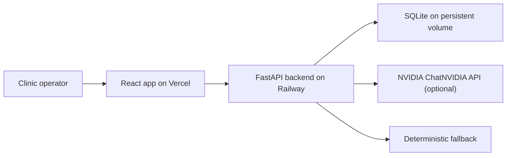
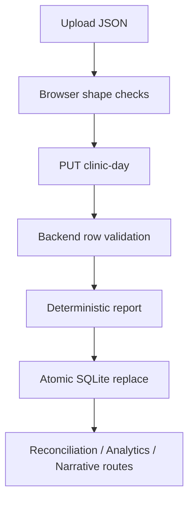
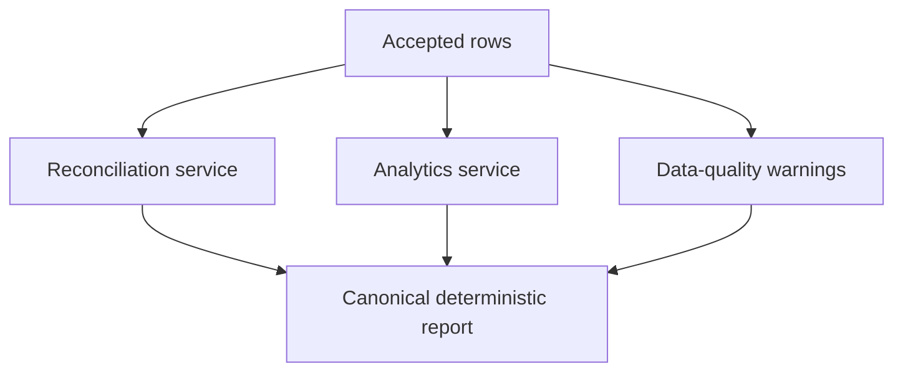
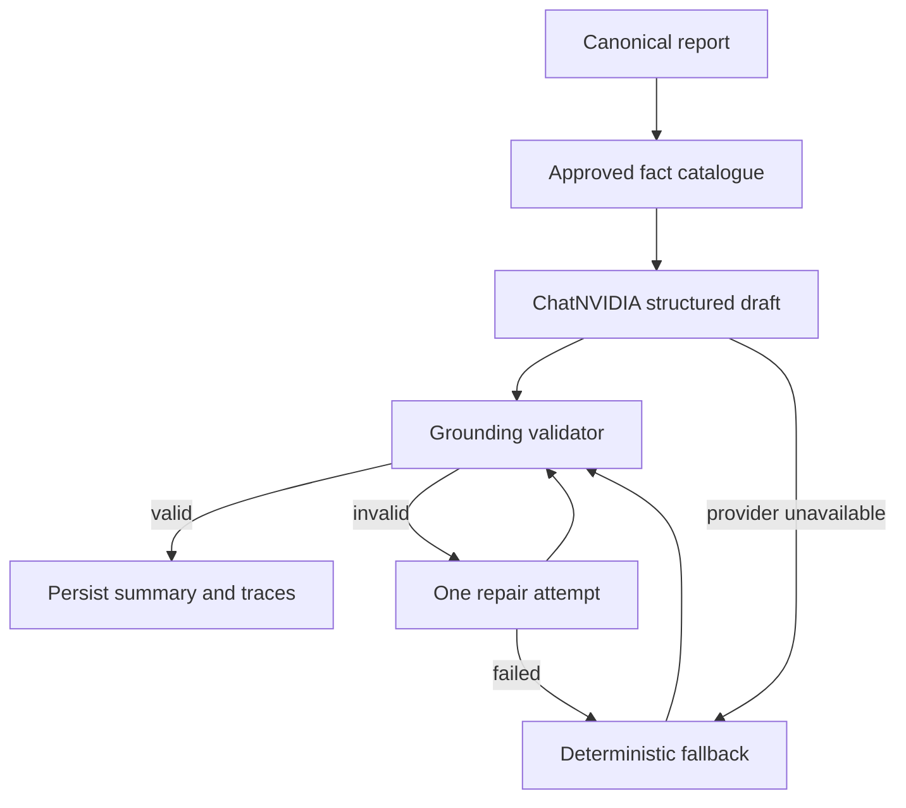
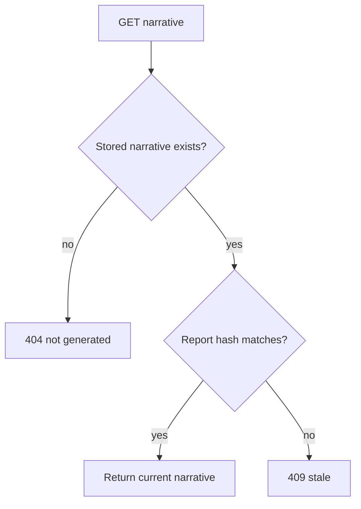

# Final Architecture

## System Context

## Import Flow

## Deterministic Report Flow

## Narrative Flow

## Cache Flow

## Deployment Topology

- Frontend: Vercel static Vite build with SPA rewrites.
- Backend: Railway Docker deployment.
- Database: SQLite file under a Railway persistent volume path configured through `DATABASE_URL`.
- AI provider: NVIDIA API from backend only.
