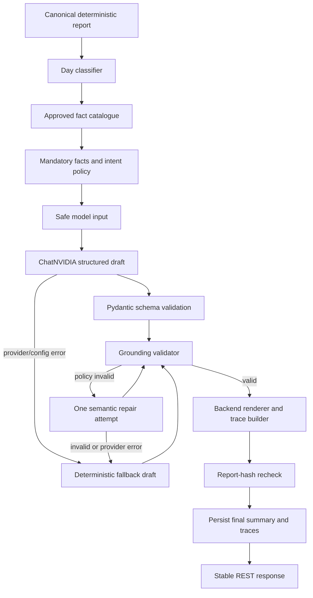

# Prompt 4 Implementation Report: Grounded Narrative Pipeline

Date: 2026-07-31

## Execution Gate

Prompt 3 was confirmed as the latest baseline commit:

- `b32e783 feat: integrate langchain nvidia provider`
- Prompt 3 report final baseline: `66 passed, 1 deselected`, branch coverage `93.56%`
- Prompt 4 gate rerun with `python3 -m pytest -m "not live_nvidia" -q`: passed
- Prompt 4 gate coverage rerun: passed at `93.56%`
- `ChatNVIDIA` import: passed with `python3`
- app import: passed with `python3`
- Alembic upgrade to head: passed
- direct HTTP LLM invocation scan: no active `httpx.post`/chat-completions provider path
- app startup without `NVIDIA_API_KEY`: passed
- missing credentials: safe deterministic fallback path remains active

Environment caveat: this macOS shell does not have `python` on PATH. Exact `python ...` commands fail with `zsh:1: command not found: python`; the project uses `python3` locally, consistent with Prompt 1-3 reports.

## Existing Grounding System Discovered

Prompt 3 had:

- strict Pydantic `NarrativeDraft`
- `ChatPromptTemplate | ChatNVIDIA.with_structured_output(...)`
- async `ainvoke`
- deterministic fallback
- placeholder rendering through `trace_service`
- report-hash cache and stale-generation rejection

Gaps found:

- no explicit day classifier
- no typed approved fact catalogue
- no section intent
- no intent-to-fact policy
- limited literal-number and unsupported-claim validation
- no semantic repair attempt after policy-invalid drafts
- fallback templates were embedded in `NarrativeService`

## Final Architecture



## Day Classification

Implemented in `backend/app/agent/classifier.py`.

Primary types:

- `empty`
- `refund_only`
- `sales_only`
- `sales_and_refunds`

Independent flags:

- `has_outstanding`
- `partial_import`
- `has_data_quality_warnings`
- `has_peak_hour`
- `has_medicine_rankings`

Classification uses only `clinic_day.report_json` and stored ingestion counts.

## Fact Catalogue

Implemented in `backend/app/agent/facts.py`.

Facts are typed as:

- `money`
- `count`
- `percentage`
- `hour_range`
- `text`
- `date`
- `status`

Every fact has:

- stable key
- exact report path
- label
- kind
- deterministic raw value
- deterministic display value

The catalogue includes only narrative-relevant facts: clinic/date context, ingestion counts, reconciliation totals, collection rate when available, refund payment-mode facts when non-zero, peak-hour facts, top rank medicine facts, and safe data-quality warning text.

It does not include raw visits, rejected raw rows, API keys, provider metadata, or arbitrary report paths.

## Placeholder Syntax And Rendering

Implemented in `backend/app/agent/placeholders.py`.

Syntax:

```text
{{fact.key}}
```

Rules:

- strict grammar
- deterministic extraction
- unknown placeholders rejected
- malformed/nested braces rejected
- duplicate placeholders rejected
- placeholder embedded inside a word rejected
- total placeholders bounded
- rendering uses exact token replacement only
- no `eval`, `exec`, dynamic attribute lookup, or template execution

## Intent And Mandatory Content Policy

Implemented in `backend/app/agent/validation.py`.

Section intents:

- `overview`
- `collections`
- `refunds`
- `peak_hour`
- `top_medicine_quantity`
- `top_medicine_revenue`
- `import_quality`
- `data_quality`
- `unavailable_metric`

The validator enforces allowed fact prefixes per intent and required facts by day type and flags. Empty and refund-only days prohibit peak-hour and medicine-ranking intents. Partial-import days require accepted/rejected-row disclosure. Data-quality warnings are neutral and do not merge medicine names.

## Literal Number And Unsupported Claim Rules

Literal-number validation applies before rendering. It rejects:

- ASCII and Unicode digits
- currency/percentage/date/time-like literal numbers
- signed/decimal/comma-style numbers through digit detection
- common English number words used as factual quantities

Backend-rendered placeholder values may contain numbers after validation.

Unsupported claim validation deterministically rejects unsupported single-day claims including profit, margin, cost, growth, trend, forecast, comparison, inventory, clinical, fraud, and tax claims. Profit is allowed only as the backend-controlled unavailable metric.

## Repair Workflow

Semantic repair is implemented in `NarrativeService`.

- Initial provider call: normal structured generation.
- If the draft is schema-compatible but policy-invalid, one repair call is made with safe validation codes and bounded invalid-draft data.
- Repair output runs through the exact same deterministic validator.
- No third semantic attempt occurs.
- Transport/config/provider failures do not trigger semantic repair.
- Repair timeout or invalid repair result falls back with `REPAIR_FAILED`.

Transport retries remain inside the provider and are separate from semantic repair.

## Deterministic Fallback

Implemented in `backend/app/agent/fallback.py`.

Fallback:

- never calls LangChain or NVIDIA
- uses the same fact catalogue
- uses the same placeholder renderer
- uses the same validator and trace builder
- has templates for empty, refund-only, sales, sales-and-refunds, partial-import, and data-quality-warning scenarios
- includes unavailable profit where applicable
- remains stable across repeated calls

## Trace Construction

Traces are constructed only by backend code from approved facts. The model supplies only fact keys.

Preserved API fields:

- `display_value`
- `report_path`
- `raw_value`

Ordering follows first appearance in the rendered narrative and deduplicates repeated facts.

## Cache And Persistence

Preserved Prompt 2/3 semantics:

- valid current narrative and `force_regenerate=false` returns cached stored response
- force regeneration invokes the provider path
- report replacement invalidates stale narrative
- report hash is rechecked before persistence
- stale generation results are rejected and not saved

Persisted data remains limited to final summary, backend traces, unavailable metrics, status, provider/model metadata, generation duration, fallback reason code, report hash, and timestamps.

Not persisted:

- raw prompt
- raw model output
- invalid draft
- repair draft
- validation internals
- API key

## Privacy And Injection Review

Findings:

- raw billing rows do not go to the model
- rejected raw rows do not go to the model
- API keys do not enter model context
- untrusted clinic/medicine/warning text is represented as data/facts
- prompt-injection-looking source text cannot change required facts or intents
- HTML-looking text is rendered as plain text in API responses
- no backend template execution is used
- no full prompt or raw model response is logged or persisted
- every final dynamic fact comes from the approved catalogue
- profit cannot be invented

## Tests Added

Added unit coverage for:

- day classifier types and flags
- fact catalogue paths, values, formatting, stable ordering, privacy
- placeholder grammar/rendering
- strict draft validation
- intent-to-fact mismatches
- required fact coverage
- literal number rejection
- unsupported claim rejection
- fallback validation across empty/refund/partial/warning scenarios
- number-like medicine names inserted safely by renderer

Added integration coverage for:

- generated provider with explicit intents
- semantic repair succeeds
- semantic repair fails and does not third-call
- transport/provider errors do not trigger repair
- safe fallback reason mapping

## Commands Executed And Final Results

```bash
git status
git log -6 --oneline
python -m pip check
python -m pytest -m "not live_nvidia" -q
python -c "from app.main import create_app; app = create_app(); print('app import successful')"
python -c "from langchain_nvidia_ai_endpoints import ChatNVIDIA; print('ChatNVIDIA import successful')"
python3 -m pip check
python3 -m pytest -m "not live_nvidia" -q
python3 -m pytest -m "not live_nvidia" --cov=app --cov-branch --cov-report=term-missing --cov-fail-under=90
python3 -c "from langchain_nvidia_ai_endpoints import ChatNVIDIA; print('ChatNVIDIA import successful')"
python3 -c "from app.main import create_app; create_app(); print('app import successful')"
DATABASE_URL=sqlite:////tmp/swasthiq_prompt4_gate.db python3 -m alembic upgrade head
DATABASE_URL=sqlite:////tmp/swasthiq_prompt4_final_alembic.db python3 -m alembic upgrade head
python3 -c "import json; from pathlib import Path; from app.main import create_app; app = create_app(); path = Path('../docs/contracts/openapi.json'); path.parent.mkdir(parents=True, exist_ok=True); path.write_text(json.dumps(app.openapi(), indent=2, sort_keys=True), encoding='utf-8'); print('generated', path)"
python3 -m pytest -m live_nvidia -q
git status --short --branch
git diff --stat
git diff --check
```

Results:

- Exact `python ...` commands: failed because `python` is not on PATH (`zsh:1: command not found: python`).
- `python3 -m pip check`: failed due to existing global environment conflicts outside this project, including incompatible `websockets` requirements between installed packages.
- App import with `python3`: passed.
- `ChatNVIDIA` import with `python3`: passed.
- Alembic upgrade head against temporary SQLite: passed.
- OpenAPI regeneration: passed; public API schema remained stable.
- `git diff --check`: passed.
- Secret/direct-provider scan: no active direct LLM HTTP invocation and no real NVIDIA key committed. Only placeholder documentation strings were found.
- Non-live tests: `94 passed, 1 deselected`
- Branch coverage: `92.95%`
- Live NVIDIA status: not run; remains skipped unless `NVIDIA_API_KEY` and `RUN_LIVE_NVIDIA_TESTS=1` are set

## Deferred To Prompt 5

- React/Vite/TypeScript frontend scaffold
- frontend API client
- UI screens
- frontend tests
- deployment and CI
