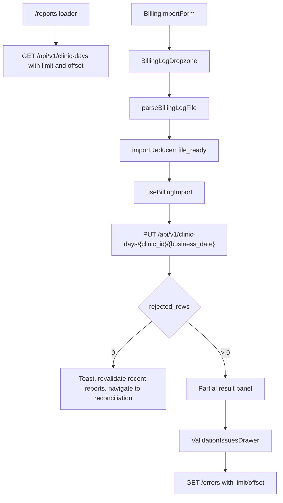

# Prompt 6 Implementation Report: Import and Report Workflow

Date: 2026-07-31

## Initial Execution Gate

- Prompt 5 latest commit confirmed: `46512e8 feat: add react frontend foundation`
- Working tree before Prompt 6 edits: clean
- `python -m pytest -m "not live_nvidia" -q`: failed because `python` is not on PATH on this machine
- `python3 -m pytest -m "not live_nvidia" -q`: passed with `94 passed, 1 deselected`
- Backend branch coverage with `python3`: passed at `92.95%`
- `npm run generate:api`: passed
- `npm run typecheck`: passed
- `npm run lint`: passed
- `npm run test:run`: passed with `7` files and `21` tests
- `npm run test:coverage`: passed with statements `90.27%`, lines `91.10%`, functions `90.32%`, branches `81.38%`
- `npm run build`: passed
- `npm ls --depth=0`: passed
- `npm audit --audit-level=moderate`: passed after registry access approval with `0 vulnerabilities`
- No unresolved merge conflicts found.
- No frontend secret values found. Existing documentation mentions `NVIDIA_API_KEY`, but frontend source/config does not contain backend secrets.

## Prompt 5 Baseline Discovered

- Reports route exists at `/reports`.
- `ReportsHomePage` was a polished placeholder with OpenAPI/native-fetch readiness, but no import or recent-report workflow.
- React Router Data Mode uses `createBrowserRouter` and `RouterProvider`.
- Existing API client functions include health, list clinic days, read clinic day, PUT clinic day, issue list, and narrative calls.
- Generated OpenAPI types include `BillingLogRequest`, `ClinicDayListItem`, `ClinicDayListResponse`, `ClinicDayResponse`, and `IngestionIssueListResponse`.
- AppShell, TopBar, desktop rail, mobile navigation, Drawer, Button, GlassPanel, StatusPill, feedback states, formatters, and route helpers are available.

## Planned Architecture

- Keep the Prompt 5 dark floating glass-panel design system.
- Use a Reports route loader for recent report lists and URL-backed filters/pagination.
- Use a feature-local import hook and reducer for file/import state because browser `File` and parsed records must stay in component memory, not route action data.
- Manually revalidate the Reports loader after successful imports.
- Keep all API calls in `frontend/src/api/`.
- Keep parsing, file validation, error mapping, request-size policy, query parsing, and state transitions as tested pure modules.
- Add feature folders under `frontend/src/features/import/` and `frontend/src/features/reports/`.

## Gaps Identified

- No accessible file dropzone.
- No JSON parser or frontend file-size policy.
- No import form, import reducer, replacement confirmation, empty-day confirmation, or import result panel.
- No validation issues drawer.
- No recent reports loader, filters, pagination, or report list presentation.
- No Prompt 6-specific fixtures or tests.

Final verification results will be recorded after implementation completion.

## Final Workflow Architecture

- Recent reports use a React Router loader so filters and pagination are URL-backed and refresh-safe.
- Import mutation stays feature-local because `File` and parsed records must remain in component memory and must not be serialized into action data, route state, URL, or storage.
- Loader data is manually revalidated after successful import.

## Import State Machine

The feature uses `importReducer` with these logical states:

- `idle`
- `reading_file`
- `file_ready`
- `submitting`
- `completed`
- `completed_with_errors`
- `failed`

The reducer carries an operation token so stale file reads and stale mutation responses cannot overwrite a newer selection/submission. Duplicate submissions are ignored while `submitting`. Failed submissions preserve the parsed file for retry.

## File Validation Rules

- One file only.
- Extension must be `.json`, case-insensitive.
- Empty MIME and inconsistent browser MIME values are permitted when the extension is `.json`.
- Frontend file limit: `4.75 MiB`.
- Backend request limit: `5 MiB`.
- File text must be readable.
- JSON must parse.
- JSON root must be an array.
- Empty arrays are valid empty clinic days.
- Rows are not inspected, normalized, filtered, or corrected by the frontend.

The `4.75 MiB` frontend cap was selected because metadata is added around the parsed records before PUT submission. The backend remains authoritative and can still reject oversized requests.

## Backend Integration

- `PUT /api/v1/clinic-days/{clinic_id}/{business_date}` receives the exact parsed records array.
- Optional clinic name/location are trimmed and omitted when blank.
- Clinic ID is trimmed and URL-encoded by the API layer.
- Business date is sent exactly as the native date input value.
- Request-size estimation is performed before mutation.
- Backend `413`, `422`, `NO_VALID_RECORDS`, network and malformed-response cases map to safe user messages.

## Partial Imports And Issues

When `rejected_rows > 0`, the page stays on `/reports`, shows a warning result panel, refreshes recent reports, and offers issue review plus continue-to-report actions. The drawer fetches safe issues from `GET /errors` using `limit` and `offset`, deduplicates loaded entries, and never renders `raw_row_json`.

## Recent Reports

- Loader calls `GET /api/v1/clinic-days` with bounded `limit=10` and non-negative `offset`.
- Filters: clinic ID, date from, date to.
- Invalid date ranges are shown as page errors without calling the backend.
- Pagination uses Previous/Next. Because the backend does not provide a total count, Next is enabled only when the current page contains `limit` reports.
- Report rows display backend-provided money summaries only.
- Open-report actions are real links to `/reports/{clinicId}/{businessDate}/reconciliation`.

## Accessibility And Responsive Decisions

- Native file input with an explicit accessible label.
- Visible button for choosing files and drag/drop alternative.
- Semantic form labels and `aria-describedby` field errors.
- First invalid field receives focus on submit.
- Import status and result panels use live regions/status text.
- Validation drawer keeps Prompt 5 focus/escape behavior.
- Recent reports render as stacked rows/cards on mobile and multi-column rows on wider screens.
- Mobile bottom navigation remains unobstructed by the import layout.

## Privacy And Security Review

- Raw records are kept only in component memory.
- Raw records are not stored in localStorage, sessionStorage, IndexedDB, cache APIs, URL query params, route state, or logs.
- No `dangerouslySetInnerHTML` is used.
- No filename, MIME type, local path, or raw content is sent to the backend.
- No frontend code references NVIDIA settings or backend secrets.
- Validation issue UI displays only backend-safe issue fields.

## Tests Added

- Parser tests: arrays, empty arrays, BOM, invalid JSON, non-array roots, read failure, row-order preservation, non-object rows.
- Validation tests: extension variants, empty MIME, size boundary, oversized files, multiple drops, date syntax, metadata trimming.
- Import reducer tests: reading, ready, submitting, success, failure, stale-token handling, reset.
- Error mapping and request-size policy tests.
- Reports query parameter tests.
- Import workflow tests for partial import, issue drawer, unsupported files, form validation, and full-success navigation.
- Recent reports component tests for money values, rejected badges, filters, pagination, empty and error states.

## Final Verification

- `python -m pytest -m "not live_nvidia" -q`: unavailable because `python` is not on PATH.
- `python3 -m pytest -m "not live_nvidia" -q`: `94 passed, 1 deselected`
- `python3 -m pytest -m "not live_nvidia" --cov=app --cov-branch --cov-report=term-missing --cov-fail-under=90`: `92.95%`
- `npm run generate:api`: passed
- `npm run typecheck`: passed
- `npm run lint`: passed
- `npm run test:run`: `15 passed`, `42 tests`
- `npm run test:coverage`: statements `88.01%`, lines `88.58%`, functions `84.88%`, branches `80.13%`
- `npm run build`: passed
- `npm ls --depth=0`: passed
- `npm audit --audit-level=moderate`: `found 0 vulnerabilities`
- `git diff --check`: passed

## Manual Smoke Verification

Used a temporary SQLite database at `/tmp/swasthiq_prompt6_smoke.db`.

- Alembic upgrade: passed
- Backend health: HTTP 200, database connected
- Vite Reports page: HTTP 200
- Synthetic backend import: HTTP 200, `created`, `completed_with_errors`, `2` received, `1` accepted, `1` rejected
- Recent reports API showed the imported report with backend money values
- Issues API returned safe issue fields and no `raw_row_json`
- Backend and frontend local servers were stopped after verification

## Work Deferred To Prompt 7

- Final reconciliation KPI cards
- Payment-mode breakdown
- Collection-rate and pending-payment panels
- Canonical report loading on reconciliation refresh
- Final analytics and AI narrative pages, which remain Prompts 8 and 9
