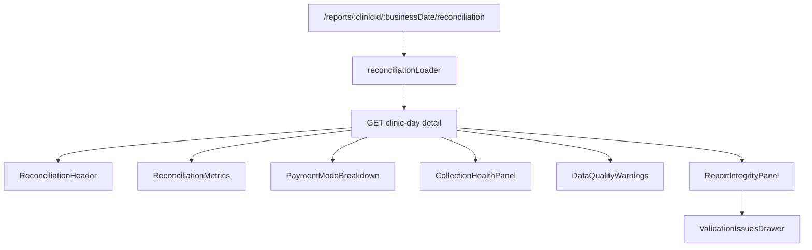

# Prompt 7 Implementation Report: Reconciliation Dashboard

Date: 2026-07-31

## Initial Execution Gate

- Prompt 6 latest commit confirmed: `c70374a feat: add billing import workflow`
- Working tree before Prompt 7 edits: clean.
- `python -m pytest -m "not live_nvidia" -q`: unavailable because `python` is not on PATH on this machine.
- `python3 -m pytest -m "not live_nvidia" -q`: passed with `94 passed, 1 deselected`.
- Backend branch coverage with `python3`: passed at `92.95%`.
- `npm run generate:api`: passed.
- `npm run typecheck`: passed.
- `npm run lint`: passed.
- `npm run test:run`: passed with `15` files and `42` tests.
- `npm run test:coverage`: passed with statements `88.01%`, lines `88.58%`, functions `84.88%`, branches `80.13%`.
- `npm run build`: passed.

## Existing Reconciliation State

- `/reports/:clinicId/:businessDate/reconciliation` existed as a guarded placeholder.
- React Router Data Mode was already active through `createBrowserRouter`.
- Prompt 6 import flow already navigated successful imports to the reconciliation route.
- Recent reports already linked to the reconciliation route.
- Prompt 6 `ValidationIssuesDrawer` provided safe paginated issue review.

## Clinic-Day Detail Contract

`GET /api/v1/clinic-days/{clinic_id}/{business_date}` returns `ClinicDayResponse` with:

- clinic metadata: `clinic_id`, `clinic_name`, `clinic_location`, `business_date`
- status and operation: `status`, optional `operation`
- ingestion counts: `received_rows`, `accepted_rows`, `rejected_rows`
- report snapshot: `report.reconciliation`, `report.analytics`, `report.data_quality_warnings`
- hashes and metadata: `source_hash`, `report_hash`, `narrative_status`, `created_at`, `updated_at`

Available reconciliation fields:

- `total_billed_paise`
- `total_collected_paise`
- `total_outstanding_paise`
- `total_refunds_paise`
- `total_discount_paise`
- `collection_rate`
- `pending_visit_count`
- `refund_visit_count`
- `by_payment_mode`

Payment-mode metrics include:

- `billed_paise`
- `collected_paise`
- `outstanding_paise`
- `refunds_paise`

## Contract Gaps

No Prompt 7 backend contract change is planned. The existing API supplies every required reconciliation value without requiring React to calculate totals, payment-mode totals, collection rate, pending visit count, refund visit count, or accepted/rejected counts.

## Planned Files

- Add `frontend/src/features/reconciliation/` with loader, presentation helpers, CSS module, components, and tests.
- Replace `frontend/src/pages/ReconciliationPage.tsx` orchestration.
- Attach `reconciliationLoader` to the reconciliation route and test route.
- Extend synthetic frontend fixtures for normal, outstanding, empty, refund-only, mixed, partial, warning, malformed, and malicious-text reports.
- Update README and frontend docs.

Final verification results will be recorded after implementation completion.

## Final Page Architecture

- Loader validates route params before calling the API and passes the router `AbortSignal`.
- Ordinary 404/network/500/malformed-response failures render controlled in-page states.
- The page uses `useRevalidator` for explicit refresh and keeps the current route context.
- Navigation state from Prompt 6 is used only for a temporary success notice; the report itself always comes from the backend.

## Backend Data Mapping

- KPI cards map directly to `total_billed_paise`, `total_collected_paise`, `total_outstanding_paise`, and `total_refunds_paise`.
- Collection health displays backend `collection_rate`, `pending_visit_count`, `refund_visit_count`, `total_discount_paise`, and `total_outstanding_paise`.
- Payment-mode rows display backend `by_payment_mode[*].billed_paise`, `collected_paise`, `outstanding_paise`, and `refunds_paise`.
- Report integrity displays safe metadata: processing status, received/accepted/rejected rows, narrative status, updated time, and report hash prefix.

React does not calculate financial totals, collection rate, counts, or payment-mode totals.

## Component Inventory

- `ReconciliationHeader`
- `ReconciliationMetrics`
- `ReconciliationMetricCard`
- `PaymentModeBreakdown`
- `CollectionHealthPanel`
- `ImportQualityBanner`
- `ActivityBanner`
- `DataQualityWarnings`
- `ReportIntegrityPanel`
- `ReconciliationSkeleton`
- `ReconciliationErrorState`

## Edge-Case Behaviour

- Empty day: all cards remain visible with backend zero values and collection rate shown as "Not applicable".
- Refund-only day: refund total is emphasized, sales collection is described as not required, and refunds remain separate.
- Sales-and-refunds day: all four cards remain visible and refunds are not netted against sales.
- Partial import: accepted/rejected counts are shown and rejected rows are explicitly excluded from totals and analytics.
- Data-quality warnings: backend warning messages render as plain text only.
- Report not found and API failures: controlled safe states with Reports navigation and retry where useful.

## Responsive And Accessibility Decisions

- Four KPI cards use one column on mobile, two columns on tablet, and four columns on desktop.
- Payment-mode data remains in a semantic table inside a horizontal scroll container on narrow screens.
- The page has one `<h1>`, semantic sections, accessible metric labels, table caption and headers, visible status text, keyboard-accessible issue review, and safe support details.

## Tests Added

- Presentation tests for metric preservation, collection status, day activity, payment ordering, collection-rate null/clamping, route validation, and import notices.
- Loader tests for valid params, AbortSignal passing, invalid params without API calls, 404, network, 500, and malformed-response states.
- Component/integration tests for exact backend values, table semantics, no total row, inconsistent backend values, empty/refund-only states, partial-import drawer access, malicious-looking plain text, not-found state, and API failure support details.

## Final Verification

- `python -m pytest -m "not live_nvidia" -q`: unavailable because `python` is not on PATH.
- `python3 -m pytest -m "not live_nvidia" -q`: passed with `94 passed, 1 deselected`.
- `python3 -m pytest -m "not live_nvidia" --cov=app --cov-branch --cov-report=term-missing --cov-fail-under=90`: passed at `92.95%`.
- `npm run generate:api`: passed.
- `npm run typecheck`: passed.
- `npm run lint`: passed.
- `npm run test:run`: passed with `18` files and `57` tests.
- `npm run test:coverage`: statements `87.78%`, lines `88.25%`, functions `85.09%`, branches `80.75%`.
- `npm run build`: passed.
- `npm ls --depth=0`: passed.
- `npm audit --audit-level=moderate`: passed with `0 vulnerabilities` after registry access approval.
- `git diff --check`: passed.

## Manual Smoke Verification

Used a temporary SQLite database at `/tmp/swasthiq_prompt7_smoke.db`.

- Alembic upgrade: passed.
- Backend health: HTTP 200, database connected.
- Synthetic normal sales-and-refunds report imported: HTTP 200, billed `20000`, collected `19000`, outstanding `1000`, refunds `1050`, collection rate `0.95`.
- Synthetic empty day imported: HTTP 200, zero totals and null collection rate.
- Synthetic refund-only day imported: HTTP 200, refunds `49000`, null collection rate.
- Synthetic partial import created: HTTP 200, status `completed_with_errors`, one safe issue.
- Validation issues endpoint returned safe issue fields only.
- Vite dev server returned HTTP 200 for normal, empty, and refund-only reconciliation deep links.
- Backend and frontend local servers were stopped after verification.

## Privacy And Security Review

- No raw billing records are loaded by the reconciliation page.
- No rejected raw rows are displayed.
- The validation drawer fetches only safe issue fields.
- No `localStorage`, `sessionStorage`, IndexedDB, cache API, `dangerouslySetInnerHTML`, frontend NVIDIA secret reference, or console logging was found in reconciliation source.
- Malicious-looking clinic and warning text is covered by component tests and renders as plain text.

## Work Deferred To Prompt 8

- Revenue-by-hour chart
- Peak-hour panel
- Top medicines by quantity
- Top medicines by revenue
- Analytics-specific empty/refund states
- Any charting or richer analytics visualization
