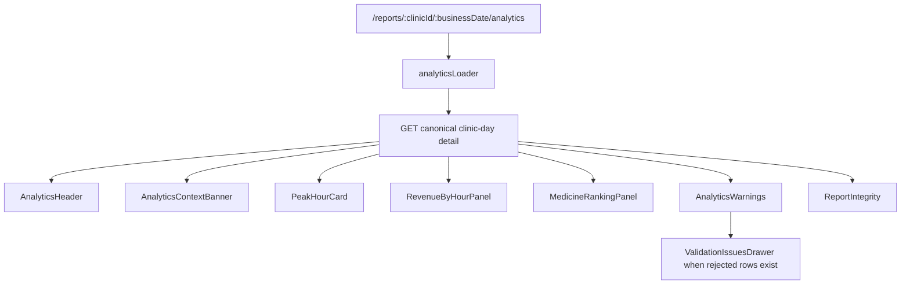

# Prompt 8 Implementation Report: Analytics Dashboard

Date: 2026-07-31

## Initial Execution Gate

- Prompt 7 latest commit confirmed: `70fd8eb feat: add reconciliation dashboard`.
- `python -m pytest -m "not live_nvidia" -q`: unavailable because `python` is not on PATH on this machine.
- `python3 -m pytest -m "not live_nvidia" -q`: passed with `94 passed, 1 deselected`.
- Backend branch coverage with `python3`: passed at `92.95%`.
- `npm run generate:api`: passed.
- `npm run typecheck`: passed.
- `npm run lint`: passed.
- `npm run test:run`: passed with `18` files and `57` tests before Prompt 8 edits.
- `npm run test:coverage`: initially failed because branches were `79.78%`; report loader coverage was added before continuing.
- `npm run build`: passed before Prompt 8 edits.

## Analytics Contract Used

The Analytics page reads the existing canonical endpoint:

```text
GET /api/v1/clinic-days/{clinic_id}/{business_date}
```

React displays these backend-owned fields:

- `report.analytics.revenue_by_hour[*].hour_utc`
- `report.analytics.revenue_by_hour[*].revenue_paise`
- `report.analytics.peak_hour`
- `report.analytics.top_medicines_by_quantity`
- `report.analytics.top_medicines_by_revenue`
- `report.data_quality_warnings`
- `ingestion.received_rows`, `accepted_rows`, and `rejected_rows`
- report metadata such as status, updated time, and report hash

No backend API, formula, aggregation, ranking, or narrative change was made for Prompt 8.

## Final Page Architecture



## Deterministic Frontend Boundaries

- Hourly chart points are mapped from backend buckets without filtering, summing, grouping, filling gaps, or sorting.
- The peak hour is highlighted only when a bucket matches backend `peak_hour.start_hour_utc`.
- Medicine rankings render in backend response order and use backend `rank`.
- Empty, refund-only, partial-import, and sales/refund labels are presentation states based on backend totals and counts only.
- Money, counts, dates, hours, and short hashes are formatted for display only.

## Component Inventory

- `AnalyticsHeader`
- `AnalyticsContextBanner`
- `RevenueByHourChart`
- `RevenueByHourTable`
- `RevenueByHourPanel`
- `PeakHourCard`
- `MedicineRankingPanel`
- `AnalyticsWarnings`
- `AnalyticsDefinitionsPanel`
- `AnalyticsSkeleton`
- `AnalyticsErrorState`

## Screenshot Fixes Included

- The health hook now accepts the backend's real `status: "healthy"` health payload, so the top bar can show "Backend online" when the backend is reachable.
- Reports loader failures are contained inside the Recent Reports panel instead of escalating to the global route error screen.
- Recent Reports filter actions use a dedicated responsive action wrapper, fixing the Apply filters / Reset overlap.

## Tests Added

- Presentation tests for backend order preservation, backend peak highlighting, context states, malformed analytics detection, and formatting helpers.
- Loader tests for valid params, AbortSignal passing, invalid params without API calls, 404, network, 500, malformed JSON, and structurally invalid analytics.
- Component tests for page heading/context, exact backend peak values, hourly table values, backend ranking order, partial-import issue drawer access, empty/refund-only states, malicious-looking text as plain text, not-found state, and retryable API errors.

## Final Verification

- `python -m pytest -m "not live_nvidia" -q`: unavailable because `python` is not on PATH.
- `python3 -m pytest -m "not live_nvidia" -q`: passed with `94 passed, 1 deselected`.
- `python3 -m pytest -m "not live_nvidia" --cov=app --cov-branch --cov-report=term-missing --cov-fail-under=90`: passed at `92.95%`.
- `npm run generate:api`: passed.
- `npm run typecheck`: passed.
- `npm run lint`: passed.
- `npm run test:run`: passed with `22` files and `74` tests.
- `npm run test:coverage`: statements `87.22%`, lines `87.60%`, functions `84.55%`, branches `81.20%`.
- `npm run build`: passed. Vite reported the existing chunk-size warning for the application bundle.
- `git diff --check`: passed.

## Manual Smoke Verification

Used the existing temporary SQLite database at `/tmp/swasthiq_prompt7_view.db`.

- Backend health through Vite proxy returned HTTP 200 with `status: "healthy"` and `database: "connected"`.
- Recent reports through Vite proxy returned the four synthetic demo clinic days.
- Analytics source report through Vite proxy returned backend hourly revenue buckets, `peak_hour`, quantity rankings, and revenue rankings.
- `/reports/CLN-DEMO-NORMAL/2026-07-31/analytics` returned HTTP 200 from Vite.
- Browser layout check confirmed the Recent Reports Apply filters and Reset buttons no longer overlap.
- The in-app browser harness did not forward page JavaScript API requests to the local proxy, while direct local HTTP checks succeeded. Use the normal Chrome tab at `http://127.0.0.1:5173` for live viewing.

## Deferred Work

- AI narrative production screen remains outside Prompt 8 scope.
- Deployment, CI, and Playwright automation remain outside Prompt 8 scope.
