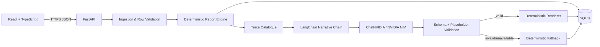

# Pre-Coding Readiness Package

## 1. Purpose

This package closes every design, contract, risk, test, deployment, and submission decision needed before the remaining implementation work begins.

The assignment requires a Python REST API, React frontend, SQLite or in-memory storage, deterministic reconciliation and analytics, an LLM-generated owner summary, and three specified screens. The implementation must prioritize correctness, grounded figures, error handling, tests, and edge-case behavior.

## 2. Current verified baseline

The existing repository was inspected and the backend test suite was run before producing this package.

```text
14 tests passed
Overall backend coverage: 86%
Deterministic reconciliation: implemented
Deterministic analytics: implemented
SQLite persistence: implemented
REST endpoints: implemented
Trace-catalogue and deterministic fallback: implemented
LangChain + NVIDIA production provider: not implemented yet
React frontend: not implemented yet
Deployment and CI: not implemented yet
```

Step 3 is therefore substantially complete, but the baseline audit identifies a few corrections that must be made at the beginning of coding. They are listed in `01_STEP_3_BASELINE_AUDIT.md`.

## 3. Locked technology stack

### Backend

- Python 3.12 for deployment; code remains compatible with Python 3.11+.
- FastAPI.
- Pydantic v2 and `pydantic-settings`.
- SQLAlchemy 2.x.
- SQLite only, as required by the assignment.
- Pytest and pytest-cov.

### Agentic narrative layer

- LangChain Python.
- `langchain-nvidia-ai-endpoints`.
- `ChatNVIDIA`.
- NVIDIA hosted NIM/API Catalog endpoint.
- Default model: `nvidia/nemotron-3-nano-30b-a3b`.
- Model remains configurable through `NVIDIA_MODEL`.
- Deterministic fallback remains mandatory and is not replaced by a second LLM.

### Frontend

- React 19.
- Vite 8.
- TypeScript.
- React Router.
- Recharts.
- CSS Modules plus a small global design-token file.
- Vitest, React Testing Library, and one Playwright smoke flow.

### Deployment

- Frontend: Vercel static deployment.
- Backend: Railway service.
- SQLite: Railway volume mounted at `/app/data`.
- Backend database URL: `sqlite:////app/data/swasthiq_eod.db`.
- GitHub Actions for backend tests and frontend lint/test/build.

## 4. Architecture locked for implementation



### Non-negotiable boundary

The deterministic modules must never import LangChain, `ChatNVIDIA`, or any provider SDK. The LLM receives a deterministic report snapshot and approved placeholders only. It never receives responsibility for calculations.

## 5. Product scope locked

### Must be delivered

- Import one clinic-day JSON log.
- Validate rows and continue with valid rows.
- Produce reconciliation totals and payment-mode breakdown.
- Produce hourly billed-revenue analytics.
- Produce separate top-medicine rankings by quantity and gross revenue.
- Generate a short owner-facing summary using LangChain and NVIDIA.
- Trace every displayed figure back to a deterministic report path.
- Handle empty, refund-only, partial-ingestion, provider-failure, and malformed-model-output states.
- Build the three required screens with a persistent sidebar.
- Deploy a live frontend and backend.
- Provide a public repository, README, API documentation, test evidence, and demo instructions.

### Explicitly excluded

- Patient, appointment, prescription, ABHA, HRM, insurance, and inventory workflows.
- Production authentication/RBAC for this synthetic single-clinic assignment.
- PostgreSQL, AWS, Kafka, Celery, Redis, or microservices.
- Autonomous/ReAct agents or LangGraph.
- LLM calculations.
- Automatic medicine typo correction.
- Profit estimation.

## 6. Remaining implementation sequence

```text
A. Correct audited Step 3 issues
B. Integrate LangChain + ChatNVIDIA
C. Complete agentic validation and tests
D. Scaffold React/Vite/TypeScript
E. Build shared app shell and import flow
F. Build reconciliation screen
G. Build analytics screen
H. Build narrative/trace screen
I. Add frontend tests and one E2E flow
J. Add security, request-size, logging, and rate-limit hardening
K. Add CI and deployment configuration
L. Run final acceptance matrix
M. Finalize README, demo video, and submission
```

## 7. Readiness verdict

All major product and technical decisions are now resolved. No clarification is required before coding starts.

The only external prerequisite is a private NVIDIA API key stored as `NVIDIA_API_KEY`. The application will still work through its deterministic fallback when the key is absent or the hosted model is unavailable.
