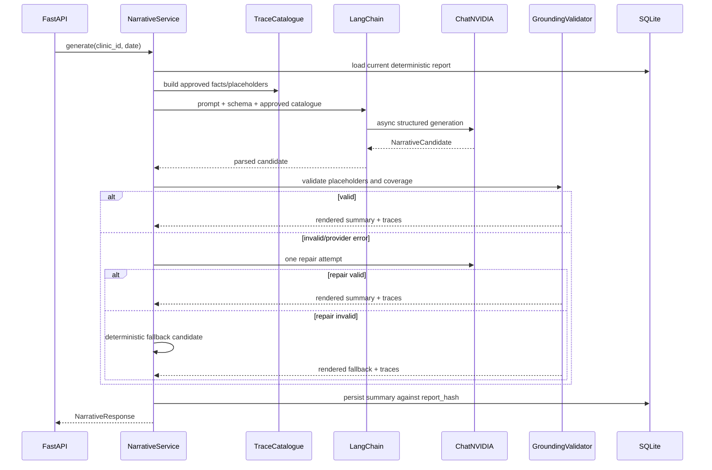

# Step 4 Technical Specification — LangChain + NVIDIA Grounded Narrative

## 1. Goal

Generate a short, WhatsApp-appropriate clinic-owner summary while proving that every date, time, count, percentage, medicine name, and money value shown in the narrative came from the deterministic report.

The LLM is a language renderer, not an analytics engine.

## 2. Selected integration

```text
LangChain Python
└── langchain-nvidia-ai-endpoints
    └── ChatNVIDIA
        └── NVIDIA hosted NIM/API Catalog
```

### Default model

```text
nvidia/nemotron-3-nano-30b-a3b
```

The model ID remains configurable. A deterministic fallback is the only runtime fallback; the application will not silently switch to another model provider.

### Dependency policy

Pin compatible minor versions for reproducibility:

```text
langchain ~= 1.3
langchain-nvidia-ai-endpoints ~= 1.4
```

The exact lockfile will be committed after installation and test execution.

## 3. Why a bounded chain, not an autonomous agent

The assignment asks for one controlled transformation from a verified report to an owner-facing summary. An autonomous tool loop would create unnecessary variability.

The implementation will use LangChain composition but no LangGraph, memory, planner, tools, database access, or ReAct loop.



## 4. Package/module structure

```text
backend/app/agent/
├── __init__.py
├── config.py
├── client.py
├── prompts.py
├── schemas.py
├── chain.py
├── grounding.py
└── exceptions.py
```

The existing provider protocol may remain under `integrations/`, but the concrete NVIDIA implementation belongs in `agent/`.

### Responsibilities

- `config.py`: provider settings and validation.
- `client.py`: construct `ChatNVIDIA`.
- `prompts.py`: system/user/repair prompt templates.
- `schemas.py`: strict output contracts.
- `chain.py`: LangChain runnable and async invocation.
- `grounding.py`: placeholder validation, required fact coverage, rendering, traces.
- `exceptions.py`: safe provider error taxonomy.

## 5. Environment contract

```env
LLM_PROVIDER=nvidia
NVIDIA_API_KEY=nvapi-...
NVIDIA_MODEL=nvidia/nemotron-3-nano-30b-a3b
NVIDIA_BASE_URL=https://integrate.api.nvidia.com/v1
LLM_TIMEOUT_SECONDS=20
LLM_MAX_RETRIES=1
LLM_TEMPERATURE=0
LLM_MAX_TOKENS=700
LLM_THINKING_MODE=false
```

Rules:

- `NVIDIA_API_KEY` is backend-only.
- The key is never returned, logged, included in traces, or embedded in frontend code.
- Missing/invalid configuration activates deterministic fallback rather than failing the whole product.
- Production startup logs may state `provider=nvidia model=<id>`, but never key fragments.

## 6. Input to the model

The LLM receives:

- Clinic display name.
- Business date.
- Deterministic report JSON.
- Import status and accepted/rejected counts.
- Approved placeholder catalogue containing display values.
- Narrative rules and output schema.

It does not receive:

- Database credentials.
- Raw billing rows.
- Rejected raw rows.
- The NVIDIA API key.
- A tool capable of reading/writing storage.

## 7. Output schema

```python
class NarrativeSectionCandidate(BaseModel):
    model_config = ConfigDict(extra="forbid")
    text_template: str = Field(min_length=1, max_length=1500)
    trace_keys: list[str] = Field(min_length=1, max_length=30)

class UnavailableMetric(BaseModel):
    model_config = ConfigDict(extra="forbid")
    metric: str = Field(min_length=1, max_length=100)
    reason: str = Field(min_length=1, max_length=500)

class NarrativeCandidate(BaseModel):
    model_config = ConfigDict(extra="forbid")
    sections: list[NarrativeSectionCandidate] = Field(min_length=1, max_length=8)
    unavailable_metrics: list[UnavailableMetric] = Field(max_length=10)
```

The chain uses:

```text
ChatPromptTemplate | ChatNVIDIA.with_structured_output(NarrativeCandidate)
```

The model output is still treated as untrusted after schema parsing.

## 8. Placeholder-only grounding

Allowed example:

```json
{
  "text_template": "{{reconciliation.total_billed_paise}} was billed and {{reconciliation.total_collected_paise}} was collected.",
  "trace_keys": [
    "reconciliation.total_billed_paise",
    "reconciliation.total_collected_paise"
  ]
}
```

Forbidden example:

```json
{
  "text_template": "₹3,190 was billed.",
  "trace_keys": []
}
```

Validation rules:

1. Every placeholder must exist in the approved catalogue.
2. Every `trace_key` must correspond to exactly one placeholder in that section.
3. Literal digits are forbidden outside placeholders.
4. Duplicate placeholders in one section are forbidden.
5. Unresolved braces are forbidden.
6. Mandatory facts for the current day type must be present.
7. Profit must appear in `unavailable_metrics`, not as a computed claim.
8. Trace values are generated by backend formatters, never accepted from the model.

## 9. Required facts by report type

### Normal sales day

Required:

- Total billed.
- Accepted visit count.
- Total collected.
- Collection rate.
- Outstanding amount and pending visits when outstanding is positive.
- Refund total when refunds are positive.
- Peak hour label and value when available.
- Top medicine by quantity when available.
- Top medicine by revenue when available.

### Empty day

Required:

- Business date.
- Plain statement that no billable activity/refunds were recorded.

### Refund-only day

Required:

- Refund visit count.
- Total refunds.
- Plain statement that no new sales were recorded.

### Partial-ingestion day

The narrative may mention rejected rows only through approved placeholders. It must not describe a rejected row's contents.

## 10. Prompt design

### System prompt objectives

- Write for a clinic owner, not a developer.
- Use a short WhatsApp-friendly tone.
- Do not calculate or infer.
- Do not output literal digits.
- Use only supplied placeholders.
- Mention only metrics present in the report.
- Do not state profit, margin, clinical advice, or recommendations.
- Return the strict structured schema only.

### User prompt sections

```text
TASK
REPORT TYPE
SAFE REPORT SNAPSHOT
APPROVED PLACEHOLDERS
MANDATORY TRACE KEYS
OUTPUT SCHEMA RULES
STYLE RULES
```

### Repair prompt

The repair attempt includes:

- The original safe report.
- The original approved catalogue.
- A short machine-generated validation code.
- No provider stack trace.
- No previous raw response unless necessary; if included, cap it and redact it.

Example repair code:

```text
UNKNOWN_TRACE_KEY
LITERAL_DIGITS_FORBIDDEN
MISSING_REQUIRED_FACTS
SCHEMA_VALIDATION_FAILED
```

## 11. Provider error taxonomy

| Provider condition | Internal code | Client result |
|---|---|---|
| Missing key | `PROVIDER_NOT_CONFIGURED` | deterministic fallback |
| Timeout | `PROVIDER_TIMEOUT` | retry once, then fallback |
| 429/rate limit | `PROVIDER_RATE_LIMITED` | fallback |
| 5xx/unavailable | `PROVIDER_UNAVAILABLE` | retry once, then fallback |
| Invalid structured output | `MODEL_SCHEMA_INVALID` | repair once, then fallback |
| Grounding violation | `MODEL_GROUNDING_INVALID` | repair once, then fallback |
| Unexpected provider error | `PROVIDER_ERROR` | fallback and safe log |

The API returns HTTP 200 when a valid deterministic fallback exists. `status` distinguishes `generated` from `fallback`.

## 12. Persistence and caching

A narrative record stores:

- `report_hash`.
- `status`.
- `summary_text`.
- `traces_json`.
- `unavailable_metrics_json`.
- `provider`.
- `model`.
- `generation_ms`.
- `fallback_reason_code` nullable.
- timestamps.

Reuse a narrative only when:

```text
stored.report_hash == current.report_hash
and force_regenerate == false
```

A clinic-day replacement with a changed report hash invalidates the old narrative atomically.

## 13. Observability

Log one structured event per generation attempt:

```json
{
  "event": "narrative_generation",
  "request_id": "req_...",
  "clinic_id": "CLN-...",
  "business_date": "2026-07-27",
  "provider": "nvidia",
  "model": "nvidia/nemotron-3-nano-30b-a3b",
  "attempt": 1,
  "status": "generated",
  "generation_ms": 1830,
  "trace_count": 10
}
```

Never log prompts, raw reports, raw model output, or API keys in production.

## 14. Agentic test matrix

### Unit tests

- Valid structured candidate renders successfully.
- Unknown placeholder rejected.
- Literal money/count/date digits rejected.
- Duplicate placeholder rejected.
- Trace key/placeholder mismatch rejected.
- Malformed braces rejected.
- Missing mandatory facts rejected.
- Profit unavailable metric auto-added or required.
- Empty-day candidate validated.
- Refund-only candidate validated.
- Partial-ingestion trace supported.

### Provider tests

- `ChatNVIDIA.ainvoke` success through a fake runnable.
- Timeout mapped to safe code.
- Rate limit mapped to safe code.
- Invalid schema triggers repair.
- First invalid, second valid succeeds.
- Two invalid attempts produce fallback.
- Missing key produces fallback without network call.

### Integration tests

- POST generates and persists NVIDIA narrative.
- GET returns current narrative.
- Force regeneration bypasses cache.
- Re-import invalidates narrative.
- Provider/model metadata returned.
- Fallback reason is safe.
- API key never appears in responses or captured logs.

### Optional live test

Mark with `@pytest.mark.live_nvidia`; skip unless `NVIDIA_API_KEY` is present. It is excluded from normal CI.

## 15. Step 4 completion gate

- LangChain is used in the production provider path.
- `ChatNVIDIA` is used, not direct `httpx` calls.
- Provider call is asynchronous.
- Every displayed figure is rendered from a trace catalogue.
- Malformed/model-invented content cannot reach the UI.
- One repair attempt and deterministic fallback work.
- Narrative cache is report-hash safe.
- Agentic validation/fallback coverage is at least 90%.
