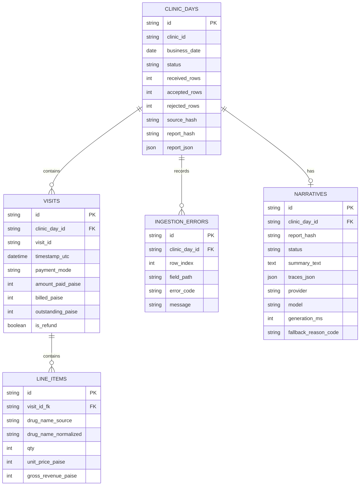

# API and Data Contracts

## 1. Contract principles

- API base path: `/api/v1`.
- JSON only.
- Route clinic/date are authoritative.
- Money is integer paise.
- All date-time inputs are ISO-8601 UTC.
- API errors use one consistent envelope.
- Clinic-day PUT is idempotent replacement.
- Deterministic reports are immutable snapshots identified by `report_hash`.

## 2. Endpoints

### Health

```http
GET /api/v1/health
```

### List clinic-days

```http
GET /api/v1/clinic-days?clinic_id={optional}&date_from={optional}&date_to={optional}&limit=20&offset=0
```

### Create or replace clinic-day

```http
PUT /api/v1/clinic-days/{clinic_id}/{business_date}
Content-Type: application/json
```

Request:

```json
{
  "clinic_name": "Mehta Multi-Specialty Clinic",
  "clinic_location": "Kanpur, Uttar Pradesh",
  "records": []
}
```

Success response: HTTP 200 for idempotent creation, replacement, and unchanged uploads. The response includes:

```json
{
  "operation": "created",
  "clinic_id": "CLN-KNP-014",
  "business_date": "2026-07-27",
  "source_hash": "sha256:...",
  "report_hash": "sha256:..."
}
```

### Read clinic-day

```http
GET /api/v1/clinic-days/{clinic_id}/{business_date}
```

### Read ingestion issues

```http
GET /api/v1/clinic-days/{clinic_id}/{business_date}/errors
```

### Generate/regenerate narrative

```http
POST /api/v1/clinic-days/{clinic_id}/{business_date}/narrative
Content-Type: application/json
```

```json
{
  "force_regenerate": false
}
```

### Read narrative

```http
GET /api/v1/clinic-days/{clinic_id}/{business_date}/narrative
```

## 3. Status codes

| Code | Meaning |
|---:|---|
| 200 | Read/replacement/generation succeeded |
| 201 | Clinic-day created |
| 404 | Clinic-day or narrative not found |
| 409 | Stale/conflicting state if used |
| 413 | Body or record count too large |
| 422 | Request/domain validation failed or all rows invalid |
| 500 | Unexpected internal error only |
| 503 | Reserved for no usable report/fallback; not used for normal LLM outage |

## 4. Error envelope

```json
{
  "error": {
    "code": "REQUEST_VALIDATION_FAILED",
    "message": "The request does not match the API contract.",
    "details": [
      {
        "field": "body.records",
        "code": "list_type",
        "message": "Input should be a valid list"
      }
    ],
    "request_id": "req_..."
  }
}
```

## 5. Ingestion behavior

### Mixed valid/invalid rows

- HTTP success.
- `status=completed_with_errors`.
- Report uses accepted rows only.
- `rejected_rows` counts unique row indices, not field-error objects.
- Issues endpoint may return multiple issues for one row.

### Empty records array

- Valid clinic-day.
- Zero report.
- No peak hour.
- Empty rankings.

### Non-empty but all invalid

- `422 NO_VALID_RECORDS`.
- Existing report remains unchanged.

## 6. Report invariants

```text
Total billed = cash billed + card billed + upi billed
Total collected = cash collected + card collected + upi collected
Total outstanding = cash outstanding + card outstanding + upi outstanding
Total refunds = cash refunds + card refunds + upi refunds
Total outstanding = total billed - total collected
```

For each non-refund visit:

```text
gross = sum(qty * unit_price_paise)
billed = gross - discount
outstanding = billed - amount_paid
```

## 7. Narrative response extension

Final response shape:

```json
{
  "status": "generated",
  "summary": "...",
  "traces": [
    {
      "display_value": "₹3,190",
      "report_path": "reconciliation.total_billed_paise",
      "raw_value": 319000
    }
  ],
  "unavailable_metrics": [
    {
      "metric": "profit",
      "reason": "Cost-price data was not provided, so profit cannot be calculated."
    }
  ],
  "report_hash": "sha256:...",
  "provider": "nvidia",
  "model": "nvidia/nemotron-3-nano-30b-a3b",
  "generation_ms": 1830,
  "fallback_reason_code": null
}
```

## 8. Database entity relationship



## 10. Final Hashing Rules

`source_hash` is SHA-256 over canonical JSON containing route `clinic_id`, route `business_date`, optional clinic metadata, and submitted records in submitted order.

`report_hash` is SHA-256 over canonical JSON containing route clinic/date, accepted/rejected counts, and deterministic report content. It excludes database IDs, request IDs, timestamps, API URLs, narrative content, LLM metadata, and UI-only formatting.

## 9. Frontend contract strategy

- Generate TypeScript API types from a checked-in OpenAPI schema if time permits.
- Otherwise maintain strict handwritten interfaces mirroring Pydantic responses.
- Commit representative synthetic response fixtures.
- Do not use `any` for API payloads.
- Reject non-2xx responses through a shared API client that understands the error envelope.
