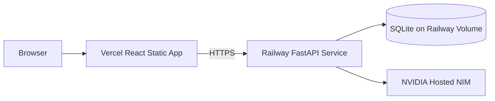

# Step 7 Plan — Deployment, Release, and Submission

## 1. Deployment architecture



This keeps the required SQLite architecture while preserving data across backend deployments.

## 2. Backend deployment — Railway

### Service configuration

- Root directory: `backend`.
- Python runtime: 3.12.
- Build command:

```bash
pip install -r requirements.txt
```

- Start command:

```bash
uvicorn app.main:app --host 0.0.0.0 --port $PORT
```

### Volume

- Attach one volume.
- Mount at `/app/data`.
- Configure:

```env
DATABASE_URL=sqlite:////app/data/swasthiq_eod.db
```

SQLite and an attached volume imply one application replica. That is acceptable for the assignment and should be documented.

### Backend variables

```env
APP_ENV=production
DATABASE_URL=sqlite:////app/data/swasthiq_eod.db
CORS_ORIGINS=https://<frontend-domain>
MAX_RECORDS_PER_REQUEST=10000
MAX_REQUEST_BODY_BYTES=5242880
STORE_REJECTED_RAW_ROWS=false
LLM_PROVIDER=nvidia
NVIDIA_API_KEY=<secret>
NVIDIA_MODEL=nvidia/nemotron-3-nano-30b-a3b
NVIDIA_BASE_URL=https://integrate.api.nvidia.com/v1
LLM_TIMEOUT_SECONDS=20
LLM_MAX_RETRIES=1
LLM_TEMPERATURE=0
LLM_MAX_TOKENS=700
```

### Health check

```text
/api/v1/health
```

## 3. Frontend deployment — Vercel

- Root directory: `frontend`.
- Framework preset: Vite.
- Build command: `npm run build`.
- Output directory: `dist`.
- Environment:

```env
VITE_API_BASE_URL=https://<backend-domain>/api/v1
```

SPA rewrite in `vercel.json` sends non-file routes to `index.html` so deep links work.

## 4. CI pipeline

### Backend job

```text
checkout
→ setup Python
→ install project + test dependencies
→ run formatting/lint checks
→ pytest with coverage gate
```

### Frontend job

```text
checkout
→ setup Node
→ npm ci
→ lint
→ unit/component tests
→ production build
```

### Optional E2E job

Run against local backend/frontend with deterministic fallback and synthetic fixtures. Do not require NVIDIA credentials.

## 5. Release checklist

### Repository hygiene

- Assignment PDF absent.
- Supplied billing files absent.
- No `.env`.
- No DB file.
- No caches/build artifacts.
- No API keys in Git history.
- Synthetic fixtures clearly labeled.

### Backend

- Swagger opens.
- Health endpoint works.
- CORS accepts only deployed frontend.
- Empty, refund-only, normal, and malformed fixtures work.
- Fallback works without NVIDIA key.
- Live NVIDIA generation works with key.

### Frontend

- All three routes open directly.
- All required cards/chart/lists/panels present.
- Mobile layout works.
- Loading/error/empty states work.
- Copy and regenerate work.

### Documentation

- Problem and approach.
- Technology stack.
- Architecture diagram.
- Local setup.
- Environment variables.
- API contracts.
- Deterministic formulas.
- LLM grounding strategy.
- Tests and results.
- Deployment links.
- Assumptions/trade-offs.
- Known limitations.
- Demo credentials: not applicable.

## 6. README final structure

```text
1. Project overview
2. Live links
3. Screenshots
4. Key features
5. Architecture
6. Grounding guarantee
7. Tech stack
8. Local setup
9. Environment configuration
10. API endpoints
11. Deterministic business rules
12. Testing
13. Deployment
14. Assumptions and trade-offs
15. Known limitations
16. Future production work
```

## 7. Demo video plan — 4 minutes

```text
0:00–0:20 Problem and architecture
0:20–0:55 Import normal-day log
0:55–1:30 Reconciliation and rejected-row handling
1:30–2:05 Analytics and separate rankings
2:05–2:45 AI summary and traced figures
2:45–3:10 Empty/refund-only edge cases
3:10–3:35 Tests, Swagger, and code structure
3:35–4:00 Trade-offs and closing
```

Do not display the NVIDIA key, `.env`, or confidential assignment PDF in the recording.

## 8. Submission package

- Public GitHub repository.
- Live frontend URL.
- Backend API/Swagger URL.
- Short demo video URL.
- README.
- Architecture and API documentation.
- Test result screenshot or copied terminal summary.

## 9. Deployment caveat disclosure

The assignment explicitly permits SQLite, but SQLite on a volume is single-instance storage and is not a horizontally scalable production database. The README should explain that this is an intentional assignment constraint; a real multi-clinic system would migrate persistence without changing the deterministic service contracts.
